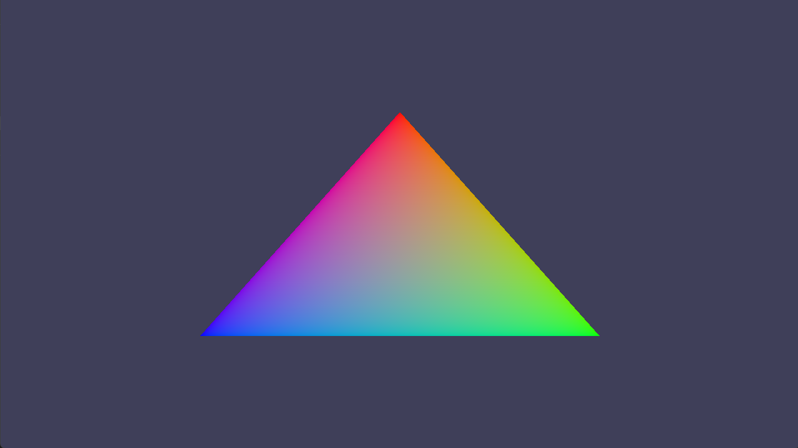

# Slang Factory Project

This repository contains my bachelor project, developed at the **University of Vienna**, Faculty of Computer Science (**Informatics**).

My name is **Oleksandr Volinskyi**.
This project is carried out under the mentorship of **Univ.-Prof. Dr. Helmut Hlavacs**.

The project is related to the research environment of **EDEN – Education, Didactics and Entertainment Computing**, a research group at the Faculty of Computer Science of the University of Vienna. EDEN pursues interdisciplinary research that combines methods and theories from Education, Learning, and Social Sciences to investigate open problems in **Computer Science Education**, **Entertainment Computing**, and education in general, especially in the context of the digital and social transformation of education. The group aims to create sustainable technology-enhanced solutions.

EDEN currently consists of three working groups:

* **Entertainment Computing Group (EC)**, led by **Univ.-Prof. Dr. Helmut Hlavacs**
* **Computer Science Education / Informatik Didaktik Group (CIED)**
* **Technology Enhanced Learning Group (TELG)**

## Project Goals

The main objectives of the project are:

* generate valid Slang shader source code programmatically
* support configurable shader generation through C++ data structures
* compile generated shaders using the Slang API
* extract and process reflection data for further use
* demonstrate practical integration with a Vulkan-based renderer
* build the project in a modular way so it can later be reused in a rendering engine

### Current Status

At the current stage, the project supports:

* generation of **vertex shaders**
* generation of **fragment shaders**
* generation of combined **vertex + fragment shader modules**
* compilation of generated Slang code to **SPIR-V**
* extraction of reflection data from compiled shaders
* readable reflection dumping for debugging
* structured reflection extraction for engine-style access
* a **console demo** for shader generation and reflection inspection
* a **Vulkan render demo** that renders a triangle using generated shaders

## Current Shader Support

The current shader generation pipeline supports:

### Vertex Shader

* configurable vertex input fields
* position input
* optional UV input
* optional vertex color input
* optional MVP transformation through a uniform buffer

### Fragment Shader

* vertex color based shading
* constant base color through a uniform buffer
* optional structure prepared for texture-based workflows

## Architecture

The project is organized into several main components:

### `SlangFactory`

Generates Slang source code from a `ShaderRequest`.

### `SlangCompiler`

Wraps the Slang compilation workflow and produces compiled shader code and layout data. (Using Slang Compiler API)

### `SlangReflectionDumper`

Prints reflection data in a readable hierarchical text format for debugging and inspection.

### `SlangReflectionExtractor`

Converts reflection data into lightweight C++ structures that are easier to use from application or engine code. (Using Slang Reflection API)

### `SlangShaderBuilder`

Acts as a high-level facade that combines:

* source generation
* compilation
* reflection extraction
* output writing helpers

### `slang_factory_demo`

A console-based demo used to:

* generate shader configurations interactively
* print generated Slang code
* print reflection dumps
* inspect extracted reflection data

### `slang_factory_render_demo`

A Vulkan-based render demo that:

* uses generated vertex and fragment shaders
* creates a graphics pipeline from compiled SPIR-V
* binds uniform buffers such as MVP and base color
* renders a triangle on screen

## Tech Stack
* **C++**
* **CMake**
* **Slang**
* **Vulkan**
* **Visual Studio / VS Code**

## Build Requirements

At the moment, the project expects a local Slang SDK installation and a Vulkan SDK installation.

Required tools/libraries:

* CMake
* C++ compiler with C++17 support
* Slang SDK
* Vulkan SDK

## Build

Run build_debug.bat

## Running the Demos

### Console Shader Demo

```bash
build/Debug/slang_factory_demo
```

This demo allows interactive configuration of the generated shader pipeline and prints:

* generated Slang source
* diagnostics
* reflection dump
* extracted reflection information

### Vulkan Render Demo

```bash
build/Debug/slang_factory_render_demo
```

This demo uses generated shaders to create a Vulkan graphics pipeline and render a triangle.



## Future Work

Possible future extensions include:

* support for additional shader stages
* more advanced material/resource generation
* stronger automatic integration with rendering engines
* more engine-oriented binding logic based on reflection
* experimentation with real engine integration